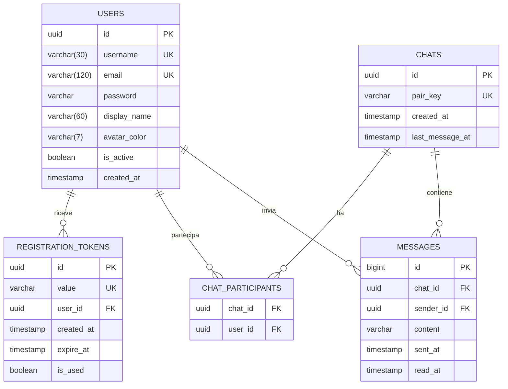
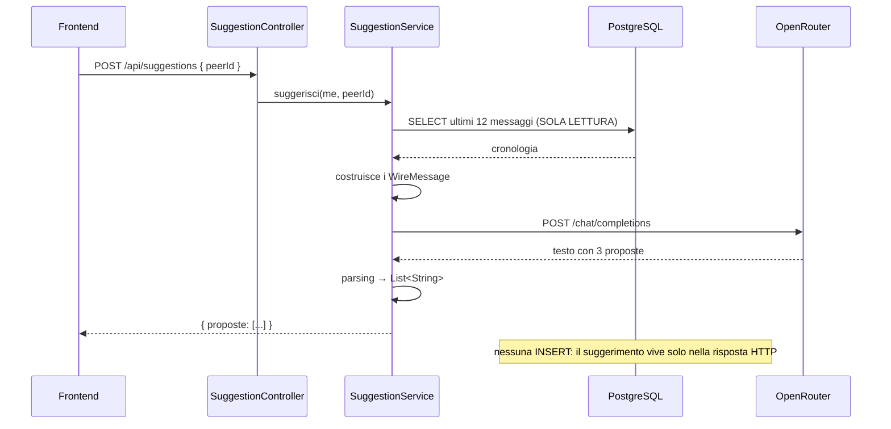

# Progettazione — Filo Rosso

Webapp di messaggistica fra utenti registrati, con suggerimenti di risposta generati
dall'AI, statistiche personali e recapito delle statistiche via email.

> **Il nome.** *Filo Rosso*, dal filo rosso che lega due persone — e dal *filo rosso
> del discorso*, quello che attraversa una conversazione e la tiene insieme. Entrambe
> le letture descrivono una chat a due.
> Forma tecnica `filorosso` (`spring.application.name`), forma in prosa **Filo Rosso**
> (email, titoli, interfaccia), marchio **F** nel quadrato dell'header email.

---

## 1. Requisiti

| # | Requisito | Dove viene risolto |
|---|---|---|
| R1 | Chat fra utenti loggati | WebSocket STOMP, `ChatWsController` + `ChatService` |
| R2 | Arrivo messaggi in diretta | `convertAndSendToUser` su `/user/queue/messages` |
| R3 | Suggerimenti di risposta dall'AI | `SuggestionService` → OpenRouter |
| R4 | **La risposta suggerita NON va salvata** | `SuggestionService` non ha repository in scrittura |
| R5 | Email di conferma registrazione | `MailService` + template Thymeleaf |
| R6 | Statistiche: inviati / ricevuti / chat aperte | `StatsService`, tre query di conteggio |
| R7 | Recapito statistiche via email con template | `statistiche.html` + `MailService` |
| R8 | Template email con Thymeleaf | `resources/templates/mail/` |
| R9 | API key come variabile d'ambiente | `OPENROUTER_API_KEY`, letta in `application.properties` |

**Scelte di progetto già fissate**

- Chat **solo 1-a-1** (DM). Niente canali di gruppo: la statistica *"chat aperte"* è
  quindi il numero di persone distinte con cui hai scambiato almeno un messaggio.
- Provider AI: **OpenRouter**, modello `nex-agi/nex-n2.5-mini:free`
  (etichetta: *Nex AGI: Nex-N2.5-Mini (free)*).

---

## 2. Stack tecnologico

| Ambito | Scelta |
|---|---|
| Linguaggio | Java 25 |
| Framework | Spring Boot 4.1.1 |
| Build | Maven |
| Database | PostgreSQL (`Progetto-settimanale-U6W1D5`, già creato su pgAdmin) |
| Persistenza | Spring Data JPA / Hibernate |
| Sicurezza | Spring Security + JWT (jjwt 0.13.0), password con BCrypt |
| Tempo reale | WebSocket con protocollo STOMP |
| Email | Spring Mail (Gmail SMTP) + Thymeleaf per i template |
| AI | OpenRouter via `RestClient` |
| Boilerplate | Lombok |
| Frontend | React 19 + Vite, `@stomp/stompjs`, `react-router-dom` |
| Grafica 3D | three.js via `@react-three/fiber` (solo pagina statistiche, §9.2) |

### Dipendenze del `pom.xml`

```
spring-boot-starter-data-jpa          persistenza
spring-boot-starter-webmvc            API REST          (in Boot 4 sostituisce -web)
spring-boot-starter-websocket         chat in diretta
spring-boot-starter-mail              invio SMTP
spring-boot-starter-thymeleaf         template delle email
spring-boot-starter-security          BCrypt + catena di filtri
spring-boot-starter-validation        @Valid sui DTO di richiesta
spring-boot-configuration-processor   autocompletamento di openrouter.* nell'IDE
io.jsonwebtoken jjwt-api/impl/jackson 0.13.0
org.postgresql postgresql             runtime
org.projectlombok lombok              optional
```

Lombok e `configuration-processor` vanno dichiarati anche negli `annotationProcessorPaths`
del `maven-compiler-plugin`, altrimenti i getter generati e i metadati delle properties
non vengono prodotti in fase di compilazione.

---

## 3. Architettura

```
┌───────────────────────── FE (React + Vite, :5173) ──────────────────────────┐
│  Login / Registrazione │ Chat (Discord-like) │ Statistiche                   │
└───────┬─────────────────────────┬────────────────────────────┬──────────────┘
        │ REST + Bearer JWT       │ STOMP over WebSocket       │ REST
        │                         │ (JWT nel frame CONNECT)    │
┌───────▼─────────────────────────▼────────────────────────────▼──────────────┐
│                        BE (Spring Boot 4.1.1, :8080)                        │
│                                                                             │
│  SecurityFilterChain ──► JwtAuthFilter          StompAuthChannelInterceptor │
│                                                                             │
│  AuthController   UserController   ChatController        ChatWsController   │
│  StatsController  SuggestionController          PresenceController          │
│         │                │                 │                   │            │
│    AuthService      UserService       ChatService         PresenceService    │
│    StatsService     SuggestionService MailService          (in memoria)     │
│         │                                 │                      │          │
└─────────┼─────────────────────────────────┼──────────────────────┼──────────┘
          │                                 │                      │
     ┌────▼─────┐                    ┌──────▼──────┐        ┌──────▼───────┐
     │PostgreSQL│                    │ OpenRouter  │        │ Gmail SMTP   │
     │          │                    │ (nessuna    │        │ (Thymeleaf)  │
     │users     │                    │  scrittura  │        │              │
     │reg_tokens│                    │  su DB)     │        │              │
     │chats     │                    └─────────────┘        └──────────────┘
     │messages  │
     └──────────┘
```

Due canali distinti verso il backend, con due meccanismi di autenticazione diversi ma
lo stesso token: le REST passano dalla catena di filtri HTTP, il WebSocket
dall'interceptor del canale STOMP (§5.4).

---

## 4. Modello dati

### 4.1 Diagramma



Quattro tabelle più una di collegamento. `chat_participants` non ha un'entità propria:
è la tabella che JPA genera da sola per la `@ManyToMany` fra `Chat` e `User`, e non
serve scriverci una classe perché non porta nessun dato suo.

Tutto ciò che si può calcolare non viene salvato (§4.6).

### 4.2 `User` — `users`

| Campo | Tipo | Vincoli |
|---|---|---|
| `id` | `UUID` | PK |
| `username` | `String(30)` | not null, **unique** |
| `displayName` | `String(60)` | not null |
| `email` | `String(120)` | not null, **unique** |
| `password` | `String` | not null, hash BCrypt |
| `avatarColor` | `String(7)` | not null, esadecimale |
| `active` | `boolean` | not null, default `false` |
| `createdAt` | `Instant` | not null, valorizzato in `@PrePersist` |

**`username` ed `email` sono campi separati.** L'email è l'identità di login e il recapito
delle notifiche; lo username è l'identità pubblica mostrata in chat. Tenerli distinti
evita di esporre l'email di tutti dentro la rubrica dei contatti.

**`active = false` alla registrazione.** L'utente esiste in tabella ma non può né loggarsi
né comparire in rubrica finché non conferma l'email (§5.1).

**`avatarColor`** viene assegnato alla creazione pescando a rotazione da una palette fissa,
così i contatti si distinguono a colpo d'occhio senza caricare immagini.

La password è un hash BCrypt: non è cifratura reversibile, è una funzione a senso unico
con un sale casuale. Nemmeno chi legge il database può risalire alla password originale.

### 4.3 `RegistrationToken` — `registration_tokens`

| Campo | Tipo | Nota |
|---|---|---|
| `id` | `UUID` | PK |
| `value` | `String(32)` | unique, alfanumerico casuale |
| `user` | `User` `@ManyToOne(LAZY)` | non null |
| `createdAt` | `Instant` | `@PrePersist` |
| `expireAt` | `Instant` | `@PrePersist`, `createdAt + 24h` |
| `used` | `boolean` | consumo singolo |

Tabella separata e non due colonne su `users`: un utente può richiedere un nuovo codice
se il primo scade, e lo storico dei tentativi resta leggibile. `used` impedisce che lo
stesso link, magari rimasto nella cronologia del browser, riattivi un account disattivato
in seguito.

### 4.4 `Chat` — `chats`

La conversazione come entità propria. Con le sole chat 1-a-1 ha esattamente due
partecipanti.

| Campo | Tipo | Nota |
|---|---|---|
| `id` | `UUID` | PK |
| `participants` | `Set<User>` `@ManyToMany` | tabella `chat_participants` |
| `pairKey` | `String(73)` | **unique**, vedi riquadro |
| `createdAt` | `Instant` | `@PrePersist` |
| `lastMessageAt` | `Instant` | aggiornato a ogni messaggio, nullo finché la chat è vuota |

**`lastMessageAt` è denormalizzato di proposito.** Serve a ordinare la sidebar per
attività recente. Senza, ogni caricamento della lista chat dovrebbe cercare il messaggio
più recente di ognuna: la classica query che va bene con 5 conversazioni e crolla con 500.
È l'unica ridondanza accettata nel modello, e si aggiorna in un solo punto
(`ChatService.invia`), quindi non può andare fuori sincrono come farebbe un contatore.

> **`pairKey`: il problema che nasce creando l'entità `Chat`.**
> Se due persone si scrivono per la prima volta nello stesso istante, due richieste
> parallele possono creare **due conversazioni separate** fra le stesse persone, e i
> messaggi si dividono fra le due senza che nessuno se ne accorga.
> `pairKey` è la coppia di id ordinata alfabeticamente (`uuid_minore + ":" + uuid_maggiore`)
> con un vincolo di unicità: è il database a rifiutare il duplicato. La race condition
> diventa così impossibile, non soltanto improbabile.
> L'ordinamento è ciò che rende la chiave identica sia che scriva A a B, sia B ad A.

### 4.5 `Message` — `messages`

| Campo | Tipo | Nota |
|---|---|---|
| `id` | `Long` IDENTITY | vedi riquadro |
| `chat` | `Chat` `@ManyToOne(LAZY)` | non null |
| `sender` | `User` `@ManyToOne(EAGER)` | non null |
| `content` | `String(1000)` | non null |
| `sentAt` | `Instant` | non null |
| `readAt` | `Instant` | **null finché il destinatario non apre la conversazione** |

`readAt` sta sul messaggio e non su una riga per partecipante perché le chat sono a due:
in questo modello è una colonna, non una tabella in più, e in cambio dà l'orario esatto
in cui ogni singolo messaggio è stato letto. Copre da solo la doppia spunta per chi
scrive, il badge dei non letti per chi riceve e il contatore in sidebar.

**`sender` è `EAGER`, `chat` è `LAZY`.** Il progetto gira con
`spring.jpa.open-in-view=false`, quindi la sessione JPA si chiude a fine metodo di
servizio. Il DTO legge `getSender().getUsername()` durante la serializzazione, cioè fuori
dalla transazione: con un proxy `LAZY` si otterrebbe una `LazyInitializationException`.
La `chat` invece non viene mai letta in serializzazione — basta il suo id, che è già nella
colonna — quindi resta `LAZY` e non paga una join inutile a ogni messaggio.

> **Perché `User` e `Chat` usano `UUID` e `Message` usa `Long`.**
> Gli id di utenti e chat finiscono negli URL e nel claim `userId` del JWT: lì l'`UUID`
> evita di rendere indovinabile *chi* sono gli altri iscritti e *quante* conversazioni
> esistono. `messages` invece è una tabella in sola aggiunta, mai esposta per id
> nell'interfaccia: l'`IDENTITY` sequenziale dà un indice più compatto e un ordine di
> inserimento naturale. È una decisione da saper motivare, non una svista.

### 4.6 Le statistiche non sono un'entità

`n. messaggi inviati`, `n. messaggi ricevuti` e `n. chat aperte` sono **dati derivati**:
si calcolano con tre `COUNT`. Nessuna tabella, nessun contatore.

Contatori denormalizzati su `users` sembrerebbero più veloci, ma introducono il classico
bug del contatore che va fuori sincrono appena un messaggio entra per un'altra strada
(una cancellazione, un import, un secondo servizio). A questi volumi il `COUNT` è
istantaneo e non può mentire.

```java
// in MessageRepository
long countBySender_Id(UUID me);

/** Ricevuti = tutto ciò che sta nelle mie chat e NON l'ho scritto io. */
@Query("""
        SELECT COUNT(m) FROM Message m
        JOIN m.chat c
        JOIN c.participants p
        WHERE p.id = :me AND m.sender.id <> :me
        """)
long countRicevuti(@Param("me") UUID me);
```

```java
// in ChatRepository
/**
 * Le chat "aperte" sono quelle in cui si è davvero scambiato qualcosa: una
 * conversazione creata e mai usata non conta. Il filtro sfrutta lastMessageAt,
 * che è già valorizzato, invece di andare a contare i messaggi.
 */
@Query("""
        SELECT COUNT(c) FROM Chat c
        JOIN c.participants p
        WHERE p.id = :me AND c.lastMessageAt IS NOT NULL
        """)
long countChatAperte(@Param("me") UUID me);
```

Rispetto a un modello senza entità `Chat`, questo conteggio è molto più diretto: non
serve più ricostruire "l'altro" con un `CASE` e contarne i valori distinti, perché la
conversazione adesso è una riga che esiste già.

### 4.7 Query della chat

```java
// in ChatRepository
/**
 * La conversazione fra due persone, cercata per chiave di coppia.
 * pairKey è costruita ordinando i due id, quindi è identica in entrambi i versi.
 */
Optional<Chat> findByPairKey(String pairKey);

/** Le mie conversazioni, la più attiva per prima. */
@Query("""
        SELECT c FROM Chat c
        JOIN c.participants p
        WHERE p.id = :me
        ORDER BY c.lastMessageAt DESC NULLS LAST
        """)
List<Chat> findMie(@Param("me") UUID me);
```

```java
// in MessageRepository
/** Tutti i messaggi di una conversazione, dal più vecchio. */
List<Message> findByChat_IdOrderBySentAtAsc(UUID chatId);

/** I messaggi di questa chat che non ho scritto io e non ho ancora aperto. */
@Query("""
        SELECT m FROM Message m
        WHERE m.chat.id = :chatId AND m.sender.id <> :me AND m.readAt IS NULL
        """)
List<Message> findNonLetti(@Param("chatId") UUID chatId, @Param("me") UUID me);

/** Il contatore del badge in sidebar, senza caricare i messaggi. */
@Query("""
        SELECT COUNT(m) FROM Message m
        WHERE m.chat.id = :chatId AND m.sender.id <> :me AND m.readAt IS NULL
        """)
long contaNonLetti(@Param("chatId") UUID chatId, @Param("me") UUID me);
```

La differenza fra `findNonLetti` e `contaNonLetti` non è pignoleria: la prima serve a
segnare i messaggi come letti e a rispedirli aggiornati, la seconda alimenta solo il
numerino della sidebar. Caricare gli oggetti per poi contarli e buttarli sarebbe lo
spreco più facile da introdurre in tutta l'applicazione.

## 5. Flussi applicativi

### 5.1 Registrazione e conferma email

```
POST /api/auth/register  { username, displayName, email, password }
   │
   ├─ AuthService: email/username già presi? → 409
   ├─ salva User(active = false, password = BCrypt, avatarColor = dalla palette)
   ├─ salva RegistrationToken(value = random 32, expireAt = +24h)
   └─ publishEvent(MailEvents.RegistrationRequested)
                │
                └─ MailEventListener  @TransactionalEventListener(AFTER_COMMIT)
                       └─ MailService → Thymeleaf mail/registrazione.html
                              └─ link: {FRONTEND_URL}/verifica?email=…&codice=…

POST /api/auth/verify  { email, codice }
   └─ token valido, non usato, non scaduto → User.active = true, token.used = true
```

**Perché un evento e non una chiamata diretta a `MailService`.** L'invio parte
`AFTER_COMMIT`, cioè dopo che la registrazione è stata scritta davvero. Tre conseguenze,
tutte volute:

1. una Gmail lenta non tiene occupata la connessione al database mentre la transazione
   è ancora aperta;
2. un invio fallito non annulla un utente già creato correttamente — `MailEventListener`
   cattura l'eccezione e la logga senza propagarla;
3. il servizio che registra l'utente non sa nulla di SMTP: dichiara che *è successo
   qualcosa*, non *cosa fare di conseguenza*.

### 5.2 Login

```
POST /api/auth/login  { email, password }
   ├─ utente inesistente o password errata → 401  (stesso messaggio in entrambi i casi)
   ├─ active == false                      → 403  "Conferma prima la tua email"
   └─ JwtService.generateToken(user)       → { token, utente }
```

Messaggio identico per utente inesistente e password errata: distinguerli direbbe a un
attaccante quali email risultano registrate.

Il JWT contiene `subject` (lo username), il claim `userId` e la scadenza. Il payload è
solo codificato in base64, non cifrato: chiunque può leggerlo, e per questo dentro non
finisce mai nulla di sensibile. Ciò che nessuno può fare senza il segreto è *falsificare
la firma*, ed è questo a rendere il token affidabile.

### 5.3 Chat in diretta

```
FE                                    BE
 │  CONNECT  (header: Authorization)   │
 ├────────────────────────────────────►│ StompAuthChannelInterceptor
 │                                     │   valida JWT → Principal(username)
 │                                     │ WebSocketEventListener → PresenceService
 │◄────────────────────────────────────┤ /topic/presence  { username, online: true }
 │  SUBSCRIBE /user/queue/messages     │
 │  SUBSCRIBE /topic/presence          │
 │                                     │
 │  SEND /app/chat.send                │
 ├────────────────────────────────────►│ ChatWsController.send(msg, principal)
 │                                     │   ChatService.save()  ← mittente dal Principal
 │◄────────────────────────────────────┤ convertAndSendToUser(destinatario)
 │◄────────────────────────────────────┤ convertAndSendToUser(mittente)
 │                                     │
 │  SEND /app/chat.read  { peerId }    │
 ├────────────────────────────────────►│ ChatService.markRead() → doppia spunta
```

**Il mittente non viaggia mai nel payload.** `IncomingMessage` contiene solo `chatId`
e `content`; chi scrive lo decide il server leggendo il `Principal` della sessione. Se il
client potesse dichiarare il proprio mittente, potrebbe scrivere a nome di chiunque.

**Due invii mirati, non un broadcast.** Il messaggio va in `/user/queue/messages` al
destinatario *e* al mittente. Al mittente serve perché l'id e il `sentAt` li assegna il
database: così entrambe le interfacce si aggiornano dalla stessa fonte, e nessun altro
utente riceve nulla.

**La cronologia viaggia su REST, non sul WebSocket.** È una domanda con una sola risposta,
fatta all'apertura dell'applicazione: il socket serve a ciò che arriva *dopo*.

**La presenza si aggancia al ciclo di vita del socket.** Spring pubblica
`SessionConnectedEvent` e `SessionDisconnectEvent`: nessun heartbeat applicativo da
scrivere. `PresenceService` tiene lo stato in memoria e conta le sessioni per utente,
perché la stessa persona può avere più schede aperte e va dichiarata offline solo quando
chiude l'ultima. Se il server riparte riparte anche la presenza — ed è corretto, perché
dopo un riavvio nessuna sessione WebSocket è più viva.

### 5.4 Autenticazione del WebSocket

Il frame STOMP CONNECT porta il JWT:

```java
// StompAuthChannelInterceptor
if (StompCommand.CONNECT.equals(accessor.getCommand())) {
    String header = accessor.getFirstNativeHeader("Authorization");
    if (header == null || !header.startsWith("Bearer ")) {
        throw new MessagingException("Token mancante");
    }
    String username = jwtService.extractUsername(header.substring(7));
    if (username == null) {
        throw new MessagingException("Token non valido");
    }
    accessor.setUser(new StompPrincipal(username));
}
```

Due dettagli non ovvi, che è facile sbagliare:

1. **Il token va nel frame STOMP CONNECT, non nell'handshake HTTP.** L'API WebSocket del
   browser non permette di aggiungere header alla richiesta di handshake. Gli header
   nativi del frame CONNECT sono invece a livello applicativo e passano senza problemi.
2. **Per questo `/ws/**` deve stare in `permitAll()`** nella `SecurityFilterChain`:
   l'handshake arriva senza `Authorization`, e se la catena di filtri HTTP lo bloccasse
   con 401 il CONNECT non verrebbe mai spedito. L'autenticazione vera avviene un gradino
   dopo, nell'interceptor del canale.

Da quel momento Spring associa il `Principal` alla sessione e può risolvere le
destinazioni che iniziano con `/user`.

### 5.5 Suggerimento AI



**Costruzione del prompt.** La cronologia viene ribaltata dal punto di vista di chi chiede
il suggerimento: i messaggi dell'interlocutore diventano `role: "user"`, i propri
diventano `role: "assistant"`. Il modello "vede" la conversazione come se fosse lui a
doverla proseguire.

```java
List<WireMessage> conversazione = new ArrayList<>();
conversazione.add(WireMessage.system("""
        Sei un assistente che propone risposte brevi in una chat fra due persone.
        Rispondi con ESATTAMENTE 3 proposte, una per riga, senza numerazione,
        senza virgolette e senza commenti. Ogni proposta al massimo 140 caratteri,
        nella stessa lingua della conversazione.
        """));
for (Message m : ultimiMessaggi) {
    conversazione.add(m.getSender().getId().equals(me.getId())
            ? WireMessage.assistant(m.getContent())
            : WireMessage.user(m.getContent()));
}
```

**L'ultimo turno deve essere dell'utente.** Dopo la cronologia va aggiunto un
messaggio `user` con l'istruzione conclusiva. Non è una rifinitura del prompt: senza,
il provider rifiuta la richiesta con `400 — "No user query found in messages"`, e
succede in due casi tutt'altro che rari, cioè **a conversazione vuota** e **ogni volta
che l'ultimo messaggio l'ho scritto io** (che in una cronologia ribaltata diventa un
turno `assistant`). Chiuderla così ha anche il vantaggio di ripetere il formato
richiesto subito prima della generazione.

L'API è senza memoria: la finestra di contesto va rispedita a ogni chiamata. Si mandano
gli ultimi `openrouter.max-history-messages` (default 12), non l'intera conversazione:
oltre quella soglia il suggerimento non migliora e la latenza cresce.

**La chiamata HTTP** è la traduzione in Java del cURL di riferimento:

```bash
curl https://openrouter.ai/api/v1/chat/completions \
  -H "Content-Type: application/json" \
  -H "Authorization: Bearer $OPENROUTER_API_KEY" \
  -d '{
    "model": "nex-agi/nex-n2.5-mini:free",
    "messages": [ { "role": "user", "content": "..." } ],
    "reasoning": { "enabled": true }
  }'
```

| Parte del cURL | Dove finisce |
|---|---|
| URL | `openrouter.base-url` + `uri("/chat/completions")` |
| `-H "Authorization"` | aggiunto per richiesta in `OpenRouterService`: contiene il segreto |
| `-H "Content-Type"` | `defaultHeader` nel `RestClient` |
| `-d '{...}'` | `body(new ChatCompletionRequest(...))` |

```java
@JsonInclude(JsonInclude.Include.NON_NULL)   // senza questo Jackson manda "reasoning": null
public record ChatCompletionRequest(String model, List<WireMessage> messages, Reasoning reasoning) {
    public record Reasoning(boolean enabled) {}
}
```

**Il reasoning va tenuto disattivato di default** (`openrouter.reasoning-enabled=false`).
`nex-n2.5-mini` è un modello reasoning: può esaurire i token ragionando *senza arrivare a
scrivere la risposta finale*, restituendo un `content` vuoto. Su un suggerimento che deve
comparire in un paio di secondi sotto la casella di testo è un rischio senza contropartita.
Resta una property, così si può accendere e confrontare il risultato.

Il client HTTP ha un timeout di lettura generoso (180s) proprio perché con il reasoning
acceso la risposta può farsi attendere; `OpenRouterService` distingue i tre modi in cui
la chiamata può andare male — errore HTTP, host irraggiungibile, risposta senza contenuto
— e li traduce in messaggi leggibili invece che in un `NullPointerException`.

**Rispetto del requisito R4.** `SuggestionService` dipende da `MessageRepository` solo
per *leggere*: nessuna entità propria, nessun `save`, metodo annotato
`@Transactional(readOnly = true)`. Se l'utente sceglie una proposta, il frontend la scrive
nella casella di testo: da lì in poi è un messaggio normale, salvato solo quando l'utente
preme invio — e a quel punto è **suo**, non dell'AI.

### 5.6 Statistiche e invio via email

```
GET  /api/stats            → { inviati, ricevuti, chatAperte, dal }
POST /api/stats/email      → StatsService calcola, pubblica MailEvents.StatsRequested
                             → MailEventListener (AFTER_COMMIT)
                             → MailService → mail/statistiche.html
                             → 202 Accepted { "messaggio": "Report inviato a ..." }
```

`202` e non `200`: quando il backend risponde, l'email è in coda per l'invio dopo il
commit, non ancora consegnata.

### 5.7 Impaginazione delle email

Tutte le email condividono `layout.html` e riempiono il frammento `contenuto`:

```java
Context context = new Context();
context.setVariables(variabili);
context.setVariable("contenuto", "mail/statistiche :: contenuto");
String html = templateEngine.process("mail/layout", context);
```

I doppi underscore nel layout (`th:replace="~{__${contenuto}__}"`) sono il *preprocessing*
di Thymeleaf: la variabile viene risolta prima, e il risultato viene poi interpretato come
espressione di frammento anziché come nome di file.

Ogni messaggio parte in **multipart/alternative**, con la versione HTML e quella di solo
testo: i client che non mostrano l'HTML usano la seconda, e avere entrambe riduce le
probabilità di finire nello spam.

I template sono impaginati con `<table>` annidate e CSS **inline**, non con `<div>` e
flexbox. Non è una scelta di stile: i client di posta — Outlook su Windows usa il motore
di rendering di Word — non supportano flexbox, grid né i fogli di stile esterni. È quello
che fanno anche Stripe e Amazon.

---

## 6. API REST e canali STOMP

Tutti gli endpoint sotto `/api` richiedono `Authorization: Bearer <token>`, tranne quelli
segnati come pubblici.

| Metodo | Path | Pubblico | Body / Query | Risposta |
|---|---|---|---|---|
| `POST` | `/api/auth/register` | ✅ | `RegisterRequestDTO` | `201` |
| `POST` | `/api/auth/verify` | ✅ | `VerifyRequestDTO` | `200` |
| `POST` | `/api/auth/login` | ✅ | `LoginRequestDTO` | `AuthResponseDTO` |
| `GET` | `/api/users` | | — | `List<UserDTO>` (rubrica, solo `active`) |
| `GET` | `/api/users/me` | | — | `UserDTO` |
| `GET` | `/api/chats` | | — | `List<ChatSummaryDTO>` (sidebar: peer, anteprima, non letti) |
| `POST` | `/api/chats` | | `CreateChatRequestDTO { peerId }` | `ChatSummaryDTO` (trova o crea) |
| `GET` | `/api/chats/{chatId}/messages` | | — | `List<MessageDTO>` |
| `GET` | `/api/presence` | | — | `Set<String>` (username online) |
| `POST` | `/api/suggestions` | | `SuggestionRequestDTO` | `SuggestionResponseDTO` |
| `GET` | `/api/stats` | | — | `StatsResponseDTO` |
| `GET` | `/api/stats/network` | | — | `List<PeerStatsDTO>` (nodi del grafo, §9.2) |
| `POST` | `/api/stats/email` | | — | `202` |

`permitAll()` nella `SecurityFilterChain`: `/api/auth/register`, `/api/auth/verify`,
`/api/auth/login`, `/ws/**`. Tutto il resto `authenticated()`.

### Canali STOMP

| Direzione | Destinazione | Payload |
|---|---|---|
| client → server | `/app/chat.send` | `IncomingMessage { chatId, content }` |
| client → server | `/app/chat.read` | `ReadRequest { chatId }` |
| server → client | `/user/queue/messages` | `OutgoingMessage` oppure `List<OutgoingMessage>` |
| server → tutti | `/topic/presence` | `PresenceUpdate { username, online }` |
| server → tutti | `/topic/users` | `UserDTO` (nuovo utente confermato) |

Il broker in memoria espone due prefissi: `/topic` per il broadcast (presenza, rubrica) e
`/queue` per le consegne mirate, usate dalle destinazioni `/user`. I messaggi in arrivo
dai client passano da `/app`.

### Note sulla configurazione di sicurezza

- **Niente CSRF e niente sessioni** (`SessionCreationPolicy.STATELESS`): non usiamo cookie
  di sessione, il token viaggia nell'header `Authorization` e va aggiunto esplicitamente
  dal JavaScript, quindi l'attacco che il CSRF previene qui non si applica.
- **Il CORS va esposto come bean `CorsConfigurationSource`**, non come `WebMvcConfigurer`.
  Con Spring Security nella catena, le richieste passano prima dai filtri: il CORS va
  applicato lì, altrimenti il preflight `OPTIONS` viene respinto con 401 prima ancora di
  arrivare al controller.
- **Serve `@Qualifier("corsConfigurationSource")`** nel costruttore di `SecurityConfig`:
  anche `mvcHandlerMappingIntrospector` implementa quell'interfaccia, e senza qualificatore
  Spring non saprebbe quale dei due bean usare.
- **Origini consentite: `http://localhost:*`.** Vite sceglie una porta diversa (5174,
  5175…) se la 5173 è occupata; fissare la sola 5173 fa fallire il frontend in modo
  difficile da diagnosticare. Lo stesso pattern va impostato su `/ws` con
  `setAllowedOriginPatterns`.
- **Un `AuthenticationEntryPoint` personalizzato**: di default Spring Security
  risponderebbe con una pagina di login HTML, ma qui siamo un'API e serve un 401 con un
  JSON che il frontend sa leggere.

---

## 7. Struttura dei file

```
Progetto-settimanale-U6W1D5/
├── PROGETTAZIONE.md                          ← questo documento
├── README.md
│
├── BE/
│   ├── pom.xml                               dipendenze §2
│   ├── .env                                  segreti reali (in .gitignore)
│   ├── .env.example                          modello da copiare
│   └── src/
│       ├── main/java/com/example/demo/
│       │   ├── DemoApplication.java          + @EnableConfigurationProperties(OpenRouterProperties)
│       │   │
│       │   ├── config/
│       │   │   ├── CorsConfig.java           bean CorsConfigurationSource
│       │   │   ├── SecurityConfig.java       catena filtri, BCrypt, permitAll
│       │   │   ├── WebSocketConfig.java      endpoint /ws, broker, interceptor
│       │   │   ├── OpenRouterProperties.java prefisso openrouter.*
│       │   │   └── RestClientConfig.java     RestClient verso OpenRouter
│       │   │
│       │   ├── security/
│       │   │   ├── JwtService.java           genera e verifica il token
│       │   │   ├── JwtAuthFilter.java        legge Authorization sulle REST
│       │   │   ├── StompAuthChannelInterceptor.java  valida il JWT sul CONNECT
│       │   │   └── StompPrincipal.java       identità della sessione STOMP
│       │   │
│       │   ├── entity/
│       │   │   ├── User.java
│       │   │   ├── RegistrationToken.java
│       │   │   ├── Chat.java
│       │   │   └── Message.java
│       │   │
│       │   ├── repository/
│       │   │   ├── UserRepository.java       findByEmail, findByUsername, existsBy…
│       │   │   ├── RegistrationTokenRepository.java
│       │   │   ├── ChatRepository.java       findByPairKey, findMie §4.7
│       │   │   └── MessageRepository.java    query chat §4.7 + conteggi §4.6
│       │   │
│       │   ├── dto/
│       │   │   ├── request/
│       │   │   │   ├── RegisterRequestDTO.java     username, displayName, email, password
│       │   │   │   ├── VerifyRequestDTO.java       email, codice
│       │   │   │   ├── LoginRequestDTO.java        email, password
│       │   │   │   └── SuggestionRequestDTO.java   peerId
│       │   │   ├── response/
│       │   │   │   ├── AuthResponseDTO.java        token, UserDTO
│       │   │   │   ├── UserDTO.java                id, username, displayName, avatarColor
│       │   │   │   ├── StatsResponseDTO.java       inviati, ricevuti, chatAperte, dal
│       │   │   │   ├── PeerStatsDTO.java           un contatto del grafo §9.2
│       │   │   │   └── SuggestionResponseDTO.java  List<String> proposte
│       │   │   ├── ws/
│       │   │   │   ├── IncomingMessage.java        chatId, content
│       │   │   │   ├── MessageDTO.java             + factory from(Message)
│       │   │   │   ├── ReadRequest.java            chatId
│       │   │   │   └── PresenceUpdate.java         username, online
│       │   │   └── openrouter/
│       │   │       ├── WireMessage.java            role + content, factory system/user/assistant
│       │   │       ├── ChatCompletionRequest.java  model, messages, reasoning
│       │   │       └── ChatCompletionResponse.java choices, error
│       │   │
│       │   ├── service/
│       │   │   ├── AuthService.java          registrazione, verifica, login
│       │   │   ├── UserService.java          rubrica, lookup, palette avatar
│       │   │   ├── ChatService.java          salva, segna letti, cronologia
│       │   │   ├── PresenceService.java      chi è online, in memoria
│       │   │   ├── StatsService.java         i tre conteggi + i nodi del grafo
│       │   │   ├── SuggestionService.java    prompt + parsing, NESSUNA scrittura
│       │   │   ├── OpenRouterService.java    chiamata HTTP e gestione errori
│       │   │   ├── MailService.java          Thymeleaf + MimeMessage
│       │   │   └── TokenGeneratorUtil.java   codici casuali
│       │   │
│       │   ├── controller/
│       │   │   ├── AuthController.java         /api/auth/**
│       │   │   ├── UserController.java         /api/users
│       │   │   ├── ChatController.java        /api/chats
│       │   │   ├── PresenceController.java     /api/presence
│       │   │   ├── SuggestionController.java   /api/suggestions
│       │   │   ├── StatsController.java        /api/stats
│       │   │   └── ChatWsController.java       @MessageMapping
│       │   │
│       │   ├── event/
│       │   │   ├── MailEvents.java           RegistrationRequested, StatsRequested
│       │   │   └── MailEventListener.java    invio AFTER_COMMIT
│       │   │
│       │   ├── listener/
│       │   │   └── WebSocketEventListener.java  connect/disconnect → presenza
│       │   │
│       │   └── exception/
│       │       ├── GlobalExceptionHandler.java  @RestControllerAdvice
│       │       ├── ResourceNotFoundException.java
│       │       ├── EmailAlreadyExistsException.java
│       │       ├── InvalidCredentialsException.java
│       │       ├── InvalidTokenException.java
│       │       ├── TokenExpiredException.java
│       │       ├── UserNotActiveException.java
│       │       └── OpenRouterException.java
│       │
│       └── main/resources/
│           ├── application.properties         §8
│           └── templates/mail/
│               ├── layout.html                intelaiatura comune
│               ├── registrazione.html         conferma email
│               └── statistiche.html           report statistiche
│
└── FEJSX/                                     §9
```

---

## 8. Configurazione

### `application.properties`

```properties
spring.application.name=filorosso

# === Caricamento di .env ===
# Spring Boot non legge i file .env di suo, e nessuna libreria esterna serve:
#   optional:      se il file non c'è l'app parte lo stesso (repo appena clonato,
#                  dove esiste solo .env.example)
#   [.properties]  dice a Spring di interpretarlo con la sintassi chiave=valore,
#                  nonostante l'estensione non standard
# Il percorso è relativo alla cartella da cui si avvia l'app, cioè BE/.
spring.config.import=optional:file:./.env[.properties]

# === Database (già creato su pgAdmin) ===
spring.datasource.url=${DB_URL:jdbc:postgresql://localhost:5432/Progetto-settimanale-U6W1D5}
spring.datasource.username=${DB_USERNAME:postgres}
spring.datasource.password=${DB_PASSWORD:1234}
# update: crea e aggiorna le tabelle da solo, comodo in sviluppo.
# In produzione servirebbero le migration (Flyway/Liquibase).
spring.jpa.hibernate.ddl-auto=${JPA_DDL_AUTO:update}
spring.jpa.open-in-view=false
spring.jpa.show-sql=false

# === Frontend (per il link di verifica nella mail) ===
app.frontend.url=${FRONTEND_URL:http://localhost:5173}

# === JWT ===
# Minimo 32 caratteri: è il requisito di HMAC-SHA256.
security.jwt.secret=${JWT_SECRET:chiave-di-sviluppo-u6w1d5-cambiami-in-produzione-32+}
security.jwt.expiration-minutes=${JWT_EXPIRATION_MINUTES:120}

# === Mail (Gmail SMTP) ===
spring.mail.host=${MAIL_HOST:smtp.gmail.com}
spring.mail.port=${MAIL_PORT:587}
spring.mail.username=${MAIL_USERNAME}
spring.mail.password=${MAIL_PASSWORD}
spring.mail.properties.mail.smtp.auth=true
spring.mail.properties.mail.smtp.starttls.enable=true
app.mail.from=${MAIL_FROM:${MAIL_USERNAME}}
# Cache disattivata in sviluppo: modificando un template l'effetto è immediato.
spring.thymeleaf.cache=${THYMELEAF_CACHE:false}

# === OpenRouter ===
# La chiave NON si scrive qui: arriva dalla variabile d'ambiente, così non finisce in git.
openrouter.api-key=${OPENROUTER_API_KEY:}
openrouter.base-url=https://openrouter.ai/api/v1
openrouter.default-model=nex-agi/nex-n2.5-mini:free
openrouter.model-label=Nex AGI: Nex-N2.5-Mini (free)
openrouter.reasoning-enabled=false
openrouter.app-title=Filo Rosso
openrouter.referer=http://localhost:5173
openrouter.max-history-messages=12
```

### `.env.example`

```bash
# Copia in .env e riempi:  cp .env.example .env
# .env è in .gitignore: le chiavi non finiscono mai su GitHub.

DB_URL=jdbc:postgresql://localhost:5432/Progetto-settimanale-U6W1D5
DB_USERNAME=postgres
DB_PASSWORD=1234

# Gmail: App Password di 16 caratteri (NON la password dell'account),
# da https://myaccount.google.com/apppasswords con la verifica in 2 passaggi attiva.
MAIL_USERNAME=tuonome@gmail.com
MAIL_PASSWORD=xxxxxxxxxxxxxxxx
MAIL_FROM=tuonome@gmail.com

# python3 -c "import secrets; print(secrets.token_hex(32))"
JWT_SECRET=xxxxxxxxxxxxxxxxxxxxxxxxxxxxxxxxxxxxxxxxxxxxxxxxxxxxxxxxxxxxxxxx

# https://openrouter.ai/keys
OPENROUTER_API_KEY=sk-or-v1-xxxxxxxxxxxxxxxxxxxxxxxxxxxxxxxxxxxx
```

---

## 9. Frontend

Ispirato a Discord nella struttura (colonna contatti a sinistra, conversazione a destra,
composer in basso), con palette diversa: Discord è *blurple* su grigio freddo, qui si va
su un **antracite caldo con il filo rosso** che dà il nome all'applicazione.

| Ruolo | Hex | Uso |
|---|---|---|
| `--bg-deep` | `#16141a` | sfondo della colonna più esterna |
| `--bg-sidebar` | `#1e1a1f` | lista contatti |
| `--bg-chat` | `#252027` | area conversazione |
| `--bg-raised` | `#2f2830` | bolla ricevuta, input |
| `--filo` | `#e0485b` | **il filo**: bolle inviate, link, accenti |
| `--filo-deep` | `#8c2233` | hover, bordi attivi, riempimenti estesi |
| `--warn` | `#f0a62b` | **errori e avvisi** |
| `--online` | `#4ec9a0` | pallino di presenza |
| `--text` | `#efe8ea` | testo principale |
| `--text-muted` | `#a99ba0` | orari, stati, segnaposto |

**I neutri sono spostati verso il rosso, non verso il blu.** Accanto al carminio danno un
effetto lacca; un grigio freddo lo farebbe sembrare un accento appiccicato su un tema
scuro qualunque.

> **Il rosso appartiene al filo, non agli errori.**
> In un'interfaccia di chat il rosso ha già due significati fortissimi — *errore* e
> *non disturbare* — e con bolle inviate rosse ogni cosa che scrivi sembrerebbe un avviso.
> Qui il rosso è il marchio, quindi i ruoli funzionali vengono ridistribuiti:
> l'**ambra** prende errori e avvisi, il **verde acqua** resta alla sola presenza online
> (verde=online è una convenzione troppo forte per combatterla).
> È una deviazione dalla convenzione, e va fatta consapevolmente e fino in fondo: un
> rosso a metà fra marchio e allarme sarebbe peggio di entrambe le scelte.

### 9.1 Struttura

```
FEJSX/src/
├── main.jsx
├── App.jsx                    router + rotte protette
├── api.js                     wrapper fetch con Bearer
├── ws.js                      client STOMP, CONNECT con Authorization
├── context/AuthContext.jsx    token + utente in localStorage
├── pages/
│   ├── Registrazione.jsx
│   ├── Login.jsx
│   ├── Verifica.jsx           legge ?email= e ?codice= dal link della mail
│   ├── Chat.jsx               pagina principale
│   └── Statistiche.jsx        tre contatori + grafo + "Inviami il report via email"
└── components/
    ├── Sidebar.jsx            rubrica, pallino di presenza, badge non letti
    ├── Avatar.jsx             iniziali su avatarColor
    ├── MessageList.jsx        bolle, divisori per data, doppia spunta
    ├── Composer.jsx           casella di testo + invio
    ├── SuggestionBar.jsx      3 chip cliccabili; al clic riempiono il composer
    ├── StatCard.jsx
    └── network/               grafo three.js, caricato in lazy (§9.2)
        ├── GrafoContatti.jsx  <Canvas> + scena
        ├── NodoContatto.jsx   sfera + etichetta di un contatto
        └── Arco.jsx           collegamento io ↔ contatto
```

Dipendenze da aggiungere a `FEJSX/package.json`: `@stomp/stompjs`, `react-router-dom`,
`three`, `@react-three/fiber`, `@react-three/drei`.

**Dettaglio di interazione su `SuggestionBar`.** Le proposte compaiono solo su richiesta
(pulsante "Suggerisci una risposta"), non a ogni messaggio ricevuto: ogni richiesta è una
chiamata a un modello esterno, e farla partire da sola significa bruciare quota e mostrare
un'attesa di qualche secondo che nessuno ha chiesto. Al clic su una proposta il testo
finisce **nella casella**, non spedito: resta modificabile, e l'invio resta una decisione
dell'utente.

### 9.2 Grafo dei contatti in three.js

Nella pagina statistiche i tre numeri richiesti da R6 sono affiancati da un grafo 3D dei
contatti, costruito con [three.js](https://threejs.org/).

**Il 3D qui codifica dati, non decora.** È la condizione che ne giustifica la presenza:

| Elemento della scena | Dato rappresentato |
|---|---|
| Nodo centrale | l'utente collegato |
| Nodi satellite | i contatti, colorati con il loro `avatarColor` |
| Raggio del nodo | messaggi scambiati con quel contatto |
| **Archi rossi** | **i fili** che ti legano a ciascuno; opacità = intensità della conversazione |
| **Numero di nodi** | **la statistica "chat aperte", resa visibile invece che letta** |

La rotazione fa un lavoro preciso: districa gli archi che in due dimensioni si
sovrapporrebbero. Se il grafo fosse leggibile identico da fermo e piatto, il 3D sarebbe
decorazione e andrebbe tolto.

**Qui il grafo chiude il cerchio del nome.** Gli archi non sono "linee di collegamento":
sono i fili rossi che legano l'utente a ciascuna persona con cui ha parlato, e più la
conversazione è fitta più il filo è acceso. La pagina statistiche smette di essere un
tabellone di numeri e diventa l'illustrazione letterale di *Filo Rosso*.

I dati arrivano da `GET /api/stats/network` (§6), che restituisce un `PeerStatsDTO` per
contatto: la query è in §4.6.

**Si usa `@react-three/fiber`, non three.js grezzo.** È il renderer React per three.js: la
scena si scrive in JSX e il ciclo di vita degli oggetti WebGL segue quello dei componenti,
invece di essere montato e smontato a mano dentro uno `useEffect` con una `ref` al canvas.
`@react-three/drei` fornisce i pezzi già pronti che servono qui — `OrbitControls` per la
rotazione col mouse, `Text` per le etichette, `Line` per gli archi.

```jsx
// Statistiche.jsx — il grafo entra in scena solo quando la pagina viene aperta
const GrafoContatti = lazy(() => import('../components/network/GrafoContatti'))

<Suspense fallback={<p>Carico il grafo…</p>}>
  <GrafoContatti contatti={contatti} io={utente} />
</Suspense>
```

```jsx
// GrafoContatti.jsx
<Canvas frameloop="demand" dpr={[1, 2]} camera={{ position: [0, 0, 14], fov: 50 }}>
  <ambientLight intensity={0.6} />
  <pointLight position={[10, 10, 10]} />
  {contatti.map((c, i) => (
    <Fragment key={c.id}>
      <Arco a={[0, 0, 0]} b={posizioneSuSfera(i, contatti.length)} peso={c.scambiati} />
      <NodoContatto contatto={c} posizione={posizioneSuSfera(i, contatti.length)} />
    </Fragment>
  ))}
  <OrbitControls enablePan={false} autoRotate={!riduciMovimento} />
</Canvas>
```

I nodi si dispongono su una sfera con la *spirale di Fibonacci*: distribuisce N punti in
modo uniforme senza gli addensamenti ai poli che darebbe una griglia latitudine/longitudine.

**Quattro vincoli non negoziabili**, perché è qui che un'idea carina diventa una pagina che
fa girare la ventola:

1. **Caricamento in lazy.** `three` pesa circa 600 KB minificati. Il grafo va importato con
   `React.lazy` + `Suspense`, così la chat — che è l'uso quotidiano — non paga il peso di
   una libreria che serve in una pagina sola.
2. **`frameloop="demand"`.** Di default un `<Canvas>` ridisegna a 60 fps per sempre, anche
   su una scena immobile. In modalità *demand* ridisegna solo quando qualcosa cambia:
   su una pagina di statistiche è esattamente il comportamento giusto.
3. **`prefers-reduced-motion`.** Se l'utente ha chiesto di ridurre le animazioni, niente
   `autoRotate`: la scena resta ferma e ruotabile a mano. È una preferenza di sistema che
   molte persone impostano per motivi medici, non un vezzo.
4. **Niente WebGL nella chat.** Il ciclo messaggio → render è la parte critica
   dell'applicazione: tenerlo lontano dal 3D garantisce che un calo di frame rate non possa
   mai ritardare la consegna di un messaggio.

**Dove il 3D non entra.** Bolle dei messaggi, lista contatti, composer: tutto ciò che si
legge e si opera resta DOM. Il testo disegnato in WebGL perde selezione, ricerca del
browser, screen reader e zoom — e una chat è fatta di testo.

---

## 10. Ordine di implementazione

| Fase | Contenuto | Verifica |
|---|---|---|
| 1 | `pom.xml`, `application.properties`, `.env`, `DemoApplication` | L'app parte e Hibernate crea le tre tabelle |
| 2 | `User`, `RegistrationToken`, repository, `SecurityConfig`, `JwtService`, `JwtAuthFilter` | `/api/auth/login` restituisce un token |
| 3 | `MailService`, `layout.html`, `registrazione.html`, eventi mail | La mail di conferma arriva e il link attiva l'account |
| 4 | `Chat`, `Message`, `ChatService`, `WebSocketConfig`, `StompAuthChannelInterceptor`, `ChatWsController` | Due browser si scambiano messaggi in diretta |
| 5 | `PresenceService`, `WebSocketEventListener`, letti/non letti | Il pallino di presenza e la doppia spunta reagiscono |
| 6 | `OpenRouterService`, `SuggestionService`, `SuggestionController` | Arrivano 3 proposte e **`messages` non cresce** |
| 7 | `StatsService`, `StatsController`, `statistiche.html` | I tre numeri tornano corretti e il report arriva via email |
| 8 | Frontend: autenticazione, chat, suggerimenti, contatori | L'applicazione è completa e usabile |
| 9 | `/api/stats/network` + grafo three.js | Il grafo mostra un nodo per contatto e la chat resta fluida |

Il grafo 3D è **l'ultima fase di proposito**: è l'unica parte non richiesta dalle
specifiche, e va affrontata quando tutto il resto funziona. Se il tempo stringe, si taglia
senza toccare nient'altro — la pagina statistiche resta completa con i soli contatori.

**Verifica esplicita della fase 6**, perché R4 è il requisito più facile da violare senza
accorgersene: prima di chiedere un suggerimento, `SELECT COUNT(*) FROM messages`.
Dopo averlo ricevuto, rifare la stessa query. Il numero deve essere identico.
