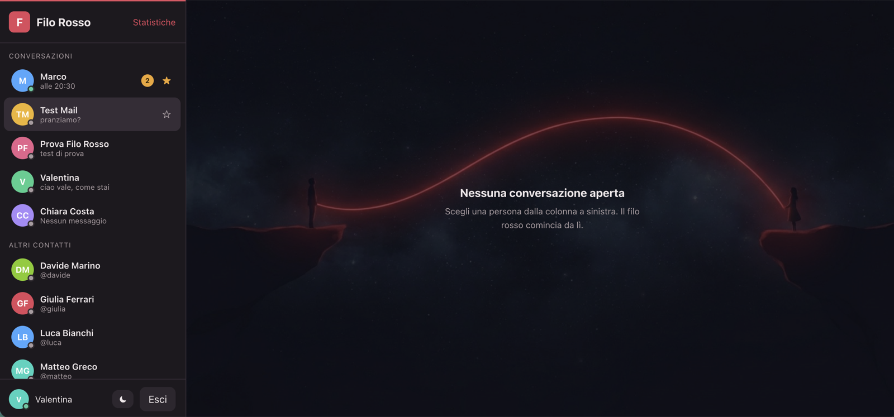
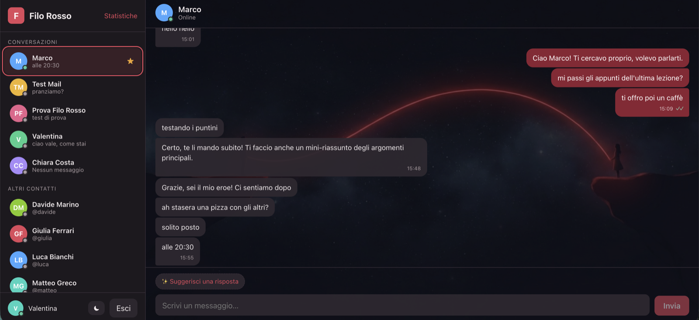
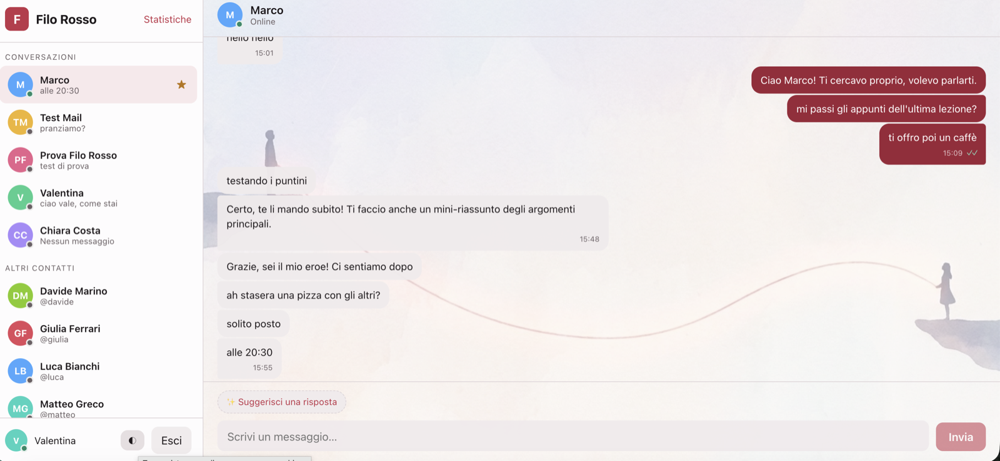
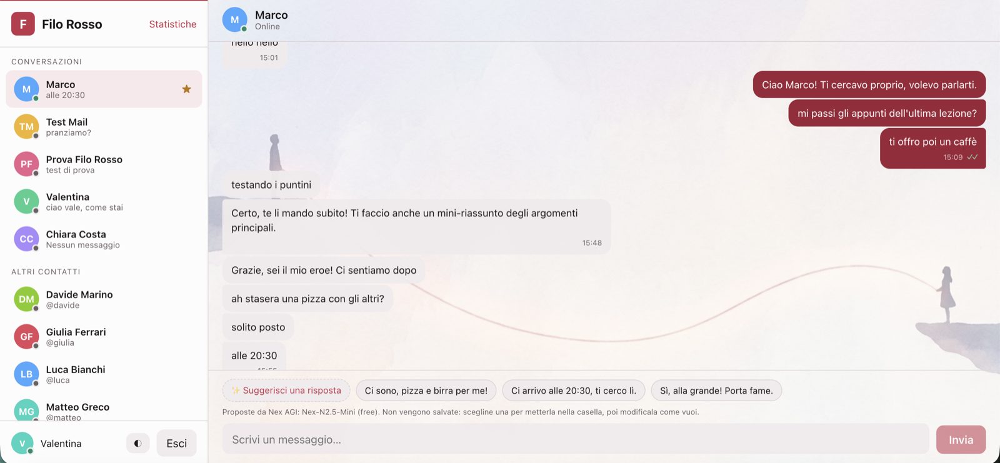
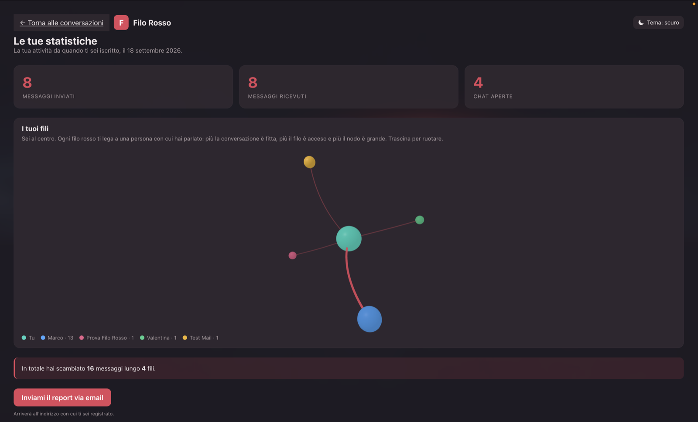
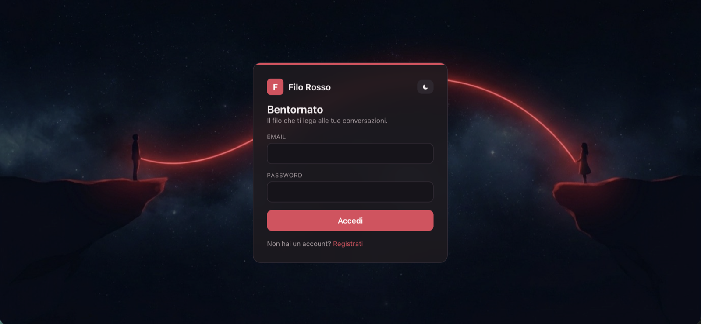
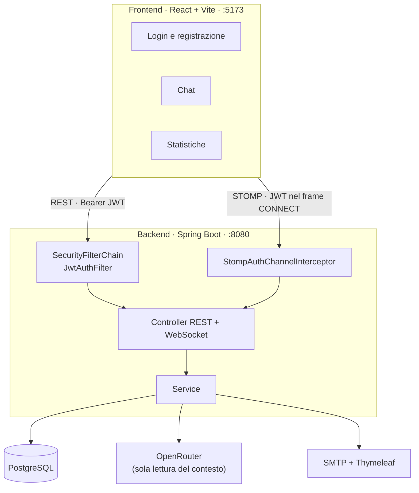
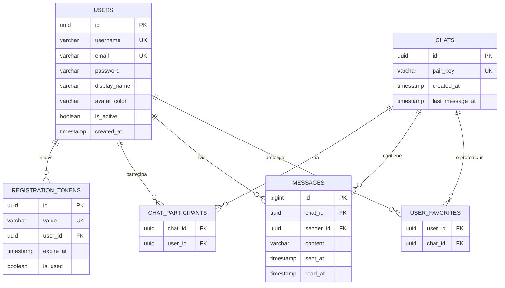
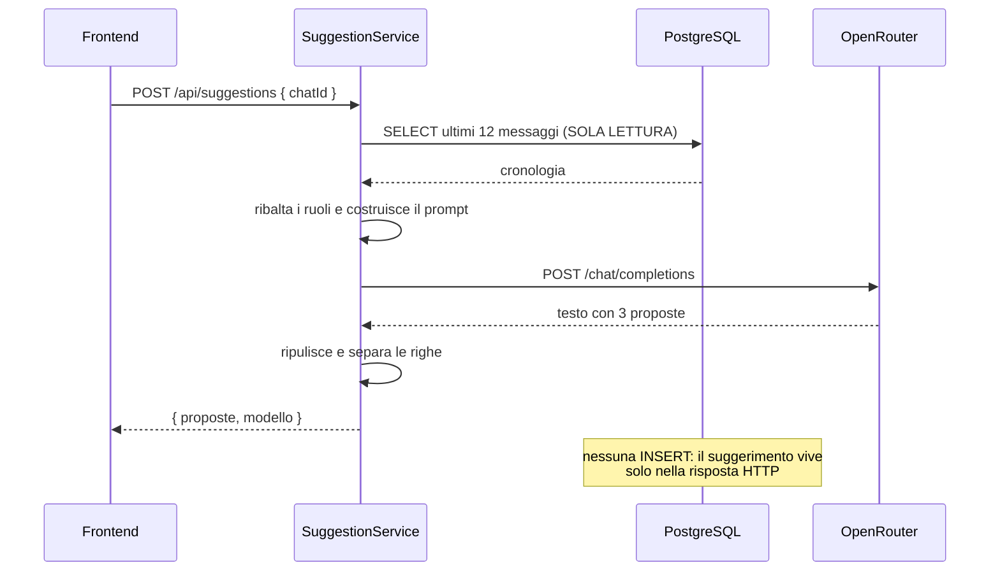
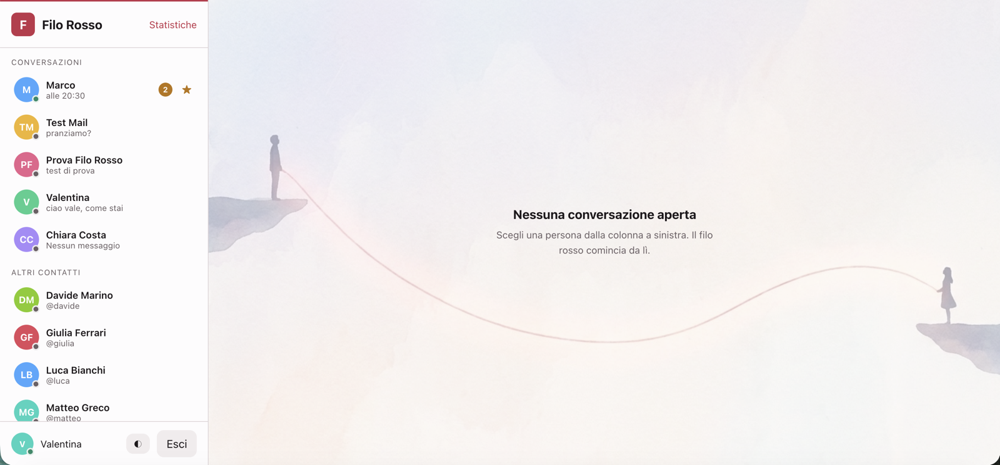

# Filo Rosso

**Una chat a due, con un'AI che ti suggerisce cosa rispondere.**

Dal filo rosso che lega due persone — e dal *filo rosso del discorso*, quello che attraversa una conversazione e la tiene insieme. Entrambe le letture descrivono una chat a due, ed entrambe sono il soggetto di questo progetto.



---

## Indice

- [Cosa fa](#cosa-fa)
- [Galleria](#galleria)
- [Stack tecnologico](#stack-tecnologico)
- [Architettura](#architettura)
- [Modello dati](#modello-dati)
- [Il suggerimento AI](#il-suggerimento-ai)
- [Palette](#palette)
- [Avvio rapido](#avvio-rapido)
- [Account dimostrativi](#account-dimostrativi)
- [API e canali](#api-e-canali)
- [Struttura del progetto](#struttura-del-progetto)
- [Logging](#logging)
- [Scelte di progetto](#scelte-di-progetto)

---

## Cosa fa

| | |
|---|---|
| 💬 **Chat in tempo reale** | Messaggi istantanei fra utenti via WebSocket, con spunte di lettura, indicatore "sta scrivendo" e stato di presenza online |
| ✨ **Suggerimenti AI** | Tre proposte di risposta generate leggendo la conversazione. **Non vengono mai salvate**: vivono solo nella risposta HTTP |
| 📊 **Statistiche personali** | Messaggi inviati, ricevuti e conversazioni aperte, più un grafo 3D dei legami |
| 📧 **Email con Thymeleaf** | Conferma della registrazione e report delle statistiche, impaginati con template HTML |
| ⭐ **Preferiti** | Le conversazioni che contano restano in cima alla lista |
| 🌗 **Tema chiaro e scuro** | Con illustrazioni dedicate, e il rispetto della preferenza di sistema |

---

## Galleria

### La conversazione, nei due temi

| Scuro | Chiaro |
|---|---|
|  |  |

I messaggi consecutivi dello stesso mittente si raggruppano e mostrano **un orario solo**: tre bolle con tre orari identici sarebbero rumore visivo.

### I suggerimenti dell'AI



Le proposte leggono davvero il contesto. Qui la conversazione finisce con *"ah stasera una pizza con gli altri? solito posto, alle 20:30"* e il modello propone **"Ci arrivo alle 20:30, ti cerco lì."**

Al clic la proposta finisce **nella casella di testo**, non spedita: resta modificabile, e l'invio resta una decisione dell'utente.

### Le statistiche e il grafo dei fili



Il grafo non decora: **codifica dati**. La dimensione del nodo è quanti messaggi avete scambiato, lo spessore del filo l'intensità della conversazione, e **il numero di nodi è la statistica "chat aperte"** resa visibile invece che letta.

### Accesso



---

## Stack tecnologico

### Backend

| Ambito | Scelta |
|---|---|
| Linguaggio | [Java 25](https://openjdk.org/projects/jdk/25/) |
| Framework | [Spring Boot 4.1.1](https://spring.io/projects/spring-boot) |
| Persistenza | Spring Data JPA / Hibernate |
| Database | [PostgreSQL](https://www.postgresql.org/) |
| Sicurezza | Spring Security + JWT ([jjwt 0.13](https://github.com/jwtk/jjwt)), password con BCrypt |
| Tempo reale | WebSocket con protocollo [STOMP](https://stomp.github.io/) |
| Email | Spring Mail (SMTP) + [Thymeleaf](https://www.thymeleaf.org/) |
| AI | [OpenRouter](https://openrouter.ai/) via `RestClient` |
| Build | Maven |

### Frontend

| Ambito | Scelta |
|---|---|
| Libreria | [React 19](https://react.dev/) |
| Build | [Vite 8](https://vite.dev/) |
| Routing | React Router 7 |
| WebSocket | [@stomp/stompjs](https://stomp-js.github.io/) |
| Grafica 3D | [three.js](https://threejs.org/) |

### Modello AI

**[Nex AGI: Nex-N2.5-Mini](https://openrouter.ai/nex-agi/nex-n2.5-mini:free)** (`nex-agi/nex-n2.5-mini:free`), servito da OpenRouter.

---

## Architettura



Due canali verso il backend, **due meccanismi di autenticazione diversi ma lo stesso token**: le REST passano dalla catena di filtri HTTP, il WebSocket dall'interceptor del canale STOMP.

Il motivo è concreto: l'API WebSocket del browser non permette di aggiungere header alla richiesta di handshake, quindi il token viaggia negli header del **frame STOMP CONNECT**, che sono a livello applicativo. Per questo `/ws/**` è in `permitAll()` — l'autenticazione vera avviene un gradino dopo.

---

## Modello dati



Quattro entità e due tabelle di collegamento. **Le statistiche non sono un'entità**: sono dati derivati, calcolati con tre `COUNT`. Un contatore salvato sarebbe più veloce ma andrebbe fuori sincrono al primo messaggio che entra per un'altra strada.

> **`pair_key` risolve un problema reale.** Se due persone si scrivono per la prima volta nello stesso istante, due richieste parallele creerebbero **due conversazioni separate** fra le stesse persone, e i messaggi si dividerebbero senza che nessuno se ne accorga. `pair_key` è la coppia di id ordinata alfabeticamente con un vincolo di unicità: è il database a rifiutare il duplicato, e la race condition diventa impossibile invece che improbabile.

Il dettaglio completo è in **[PROGETTAZIONE.md](PROGETTAZIONE.md)**.

---

## Il suggerimento AI



**Il punto di vista viene ribaltato.** I messaggi dell'interlocutore diventano `role: "user"`, i propri diventano `role: "assistant"`: il modello vede la conversazione come se toccasse a lui proseguirla. Due persone nella stessa chat ricevono quindi suggerimenti diversi, ciascuno dalla propria parte.

**Il requisito "non salvare" è garantito dalla struttura, non dalla buona volontà:** `SuggestionService` non ha entità proprie, non chiama mai `save`, e il metodo è annotato `@Transactional(readOnly = true)` — se qualcuno ci aggiungesse una scrittura, la transazione la rifiuterebbe.

---

## Palette

Il rosso appartiene al **filo**: marchio, bolle inviate, accenti. **Non agli errori.**

In una chat il rosso ha già due significati fortissimi — *errore* e *non disturbare* — e con bolle inviate rosse ogni cosa che scrivi sembrerebbe un avviso. Qui il rosso è il marchio, quindi i ruoli funzionali sono ridistribuiti: l'**ambra** prende errori e avvisi, il **verde** resta alla sola presenza online.

### Tema scuro

| Ruolo | Colore | |
|---|---|---|
| Il filo | `#e0485b` |  accenti, link, stelle |
| Filo profondo | `#8c2233` |  bolle inviate |
| Attenzione | `#f0a62b` |  errori, badge non letti |
| Presenza | `#4ec9a0` |  pallino online |
| Sfondo profondo | `#16141a` |  |
| Sidebar | `#1e1a1f` |  |
| Testo | `#efe8ea` |  |

### Tema chiaro

| Ruolo | Colore | |
|---|---|---|
| Il filo | `#c0334a` |  |
| Filo profondo | `#9c2438` |  |
| Attenzione | `#b87407` |  |
| Presenza | `#1f8a68` |  |
| Sfondo | `#efe9eb` |  |
| Testo | `#1d181b` |  |



I neutri sono spostati verso il rosso e non verso il blu: accanto al carminio danno un effetto lacca invece di sembrare un tema scuro qualunque. Il chiaro **non è il buio invertito** — i rossi si scuriscono per restare leggibili sul bianco, l'ambra passa a `#b87407`, e l'illustrazione di sfondo cambia insieme alla palette.

---

## Avvio rapido

### Prerequisiti

- **JDK 25**
- **Node.js 20+**
- **PostgreSQL** in esecuzione
- Una chiave [OpenRouter](https://openrouter.ai/keys) (gratuita)
- Un account Gmail con [App Password](https://myaccount.google.com/apppasswords) per le email

### 1. Clona il repository

```bash
git clone https://github.com/Valelearn1/Progetto-settimanale-U6W1D5.git
cd Progetto-settimanale-U6W1D5
```

### 2. Crea il database

```sql
CREATE DATABASE "Progetto-settimanale-U6W1D5";
```

Le tabelle le crea Hibernate al primo avvio (`ddl-auto=update`).

### 3. Configura i segreti

```bash
cd BE
cp .env.example .env
```

Apri `.env` e riempi:

```bash
DB_USERNAME=postgres
DB_PASSWORD=la-tua-password

MAIL_USERNAME=tuonome@gmail.com
MAIL_PASSWORD=app-password-di-16-caratteri   # NON la password dell'account

# python3 -c "import secrets; print(secrets.token_hex(32))"
JWT_SECRET=almeno-32-caratteri

OPENROUTER_API_KEY=sk-or-v1-...
```

> `.env` è escluso da git: le credenziali non finiscono mai sul repository. Spring Boot non legge i `.env` di suo — ci pensa la riga `spring.config.import=optional:file:./.env[.properties]` in `application.properties`, senza librerie aggiuntive.

### 4. Avvia il backend

```bash
cd BE
./mvnw spring-boot:run
```

Parte su **http://localhost:8080** e crea da solo sei profili dimostrativi.

### 5. Avvia il frontend

```bash
cd FEJSX
npm install
npm run dev
```

Apri **http://localhost:5173**.

---

## Account dimostrativi

Sei profili creati automaticamente all'avvio, tutti con password **`password123`**:

| Nome | Email |
|---|---|
| Giulia Ferrari | `giulia@filorosso.demo` |
| Luca Bianchi | `luca@filorosso.demo` |
| Sofia Romano | `sofia@filorosso.demo` |
| Matteo Greco | `matteo@filorosso.demo` |
| Chiara Costa | `chiara@filorosso.demo` |
| Davide Marino | `davide@filorosso.demo` |

Sono **utenti veri sul database**, non un elenco finto nel frontend: puoi aprire conversazioni con loro, e accedere come loro da un'altra finestra.

> **Per vedere la chat in diretta** servono due sessioni: una finestra normale e una **in incognito**, perché il token vive in `localStorage` ed è condiviso per origine.

Il seeder si disattiva con `app.seed.enabled=false`.

---

## API e canali

### REST

Tutti gli endpoint richiedono `Authorization: Bearer <token>` tranne quelli segnati come pubblici.

| Metodo | Path | Pubblico | Risposta |
|---|---|:---:|---|
| `POST` | `/api/auth/register` | ✅ | `201` |
| `POST` | `/api/auth/verify` | ✅ | `200` |
| `POST` | `/api/auth/login` | ✅ | token + utente |
| `GET` | `/api/users` | | rubrica |
| `GET` | `/api/users/me` | | il proprio profilo |
| `GET` | `/api/chats` | | sidebar: interlocutore, anteprima, non letti, preferita |
| `POST` | `/api/chats` | | apre o ritrova la conversazione |
| `PUT` | `/api/chats/{id}/favorite` | | preferito on/off |
| `GET` | `/api/chats/{id}/messages` | | cronologia |
| `GET` | `/api/presence` | | chi è online adesso |
| `POST` | `/api/suggestions` | | tre proposte dall'AI |
| `GET` | `/api/stats` | | inviati, ricevuti, chat aperte |
| `GET` | `/api/stats/network` | | i nodi del grafo |
| `POST` | `/api/stats/email` | | `202` — report in coda |

### Canali STOMP

| Direzione | Destinazione | Payload |
|---|---|---|
| client → server | `/app/chat.send` | `{ chatId, content }` |
| client → server | `/app/chat.read` | `{ chatId }` |
| client → server | `/app/chat.typing` | `{ chatId, scrivendo }` |
| server → utente | `/user/queue/messages` | messaggio, o gruppo appena letto |
| server → utente | `/user/queue/typing` | `{ chatId, username, scrivendo }` |
| server → tutti | `/topic/presence` | `{ username, online }` |
| server → tutti | `/topic/users` | nuovo utente in rubrica |

> **Il mittente non viaggia mai nel payload.** Chi scrive lo decide il server leggendo il `Principal` della sessione, e viene sempre verificato che partecipi davvero a quella conversazione.

---

## Struttura del progetto

```
Progetto-settimanale-U6W1D5/
├── PROGETTAZIONE.md          scelte di progetto, entità, flussi
├── README.md
├── docs/screenshot/
│
├── BE/                       Spring Boot
│   ├── .env.example
│   └── src/main/
│       ├── java/com/example/demo/
│       │   ├── config/       sicurezza, CORS, WebSocket, OpenRouter, seeder
│       │   ├── security/     JWT, filtro HTTP, interceptor STOMP
│       │   ├── entity/       User · RegistrationToken · Chat · Message
│       │   ├── repository/
│       │   ├── dto/          request · response · ws · openrouter
│       │   ├── service/      auth · chat · presenza · statistiche · AI · mail
│       │   ├── controller/   REST + @MessageMapping
│       │   ├── event/        eventi mail, inviati dopo il commit
│       │   ├── listener/     connessione e disconnessione WebSocket
│       │   └── exception/    eccezioni + @RestControllerAdvice
│       └── resources/
│           ├── application.properties
│           ├── logback-spring.xml
│           └── templates/mail/   layout · registrazione · statistiche
│
└── FEJSX/                    React + Vite
    ├── public/               sfondi dei due temi
    └── src/
        ├── api.js            REST con Bearer
        ├── ws.js             client STOMP
        ├── context/          autenticazione, tema
        ├── pages/            login · registrazione · verifica · chat · statistiche
        └── components/
            └── network/      grafo three.js, caricato in lazy
```

---

## Logging

Console durante lo sviluppo, file con rotazione per lo storico:

```
BE/logs/filorosso.log                    corrente
BE/logs/filorosso.2026-09-18.0.log.gz    archivio compresso
```

Ruota a 10 MB o ogni giorno, conserva 14 giorni con tetto a 200 MB.

**I 4xx vanno a `WARN`, i 5xx a `ERROR`.** Un 404 o una password sbagliata non sono guasti: è la richiesta a essere sbagliata. Se fosse tutto `ERROR`, gli errori veri finirebbero sepolti sotto le password sbagliate.

```
WARN  AuthService            : Login fallito: password errata per marco@example.com
WARN  GlobalExceptionHandler : 401 - Email o password non validi
INFO  OpenRouterService      : OpenRouter: modello=nex-agi/nex-n2.5-mini:free
                               reasoning=false durata=1165 ms messaggi=14
INFO  WebSocketEventListener : Presenza: 'marco' e' online
```

**Nessun segreto finisce nei log.** Dei token si registra solo il rifiuto, mai il valore; del login fallito l'email tentata, mai la password; del codice di attivazione il fatto, non il codice — chi legge i log non deve poter attivare account altrui.

---

## Scelte di progetto

Alcune decisioni che vale la pena raccontare, e il perché.

**Le email partono dopo il commit.** `MailService` non viene chiamato direttamente: i service pubblicano un evento consegnato in `AFTER_COMMIT`. Così un SMTP lento non tiene occupata la connessione al database, e un invio fallito non annulla una registrazione già andata a buon fine.

**Nessuna entità per le chat di gruppo.** Con conversazioni a due, la coppia mittente/destinatario definisce già la conversazione. `readAt` sta sul singolo messaggio e non su un segnalibro per partecipante: in questo modello è una colonna invece di una tabella, e in cambio dà l'orario esatto in cui ogni messaggio è stato letto.

**I preferiti stanno su `User`, non su `Chat`.** "Preferita" è una proprietà *tua*: un flag sulla conversazione la marcherebbe anche per l'altra persona, che non l'ha scelto.

**`last_message_at` è l'unica ridondanza accettata.** Serve a ordinare la sidebar per attività recente senza cercare, per ogni chat, il suo messaggio più recente. Si aggiorna in un solo punto, quindi non può andare fuori sincrono.

**Il ragionamento esteso del modello è spento di default.** Un modello *reasoning* può esaurire i token ragionando senza arrivare a scrivere la risposta finale. Su un suggerimento che deve comparire in due secondi è un rischio senza contropartita — resta una property per poterlo accendere e confrontare.

**Il grafo 3D è scritto con three.js diretto**, non con `@react-three/fiber`: alla data di scrittura richiede `react >=19 <19.3` e il progetto usa React 19.3. Forzare quel vincolo avrebbe prodotto un albero di dipendenze incoerente. La libreria è caricata in **lazy**: pesa quanto tutto il resto dell'applicazione, e chi apre solo la chat non la scarica mai.

---

## Documentazione

- **[PROGETTAZIONE.md](PROGETTAZIONE.md)** — il documento di progetto: logica, entità, flussi, ogni file con il suo ruolo

---

<div align="center">

Progetto settimanale · [EPICODE](https://www.epicode.com/) · U6W1D5

</div>
